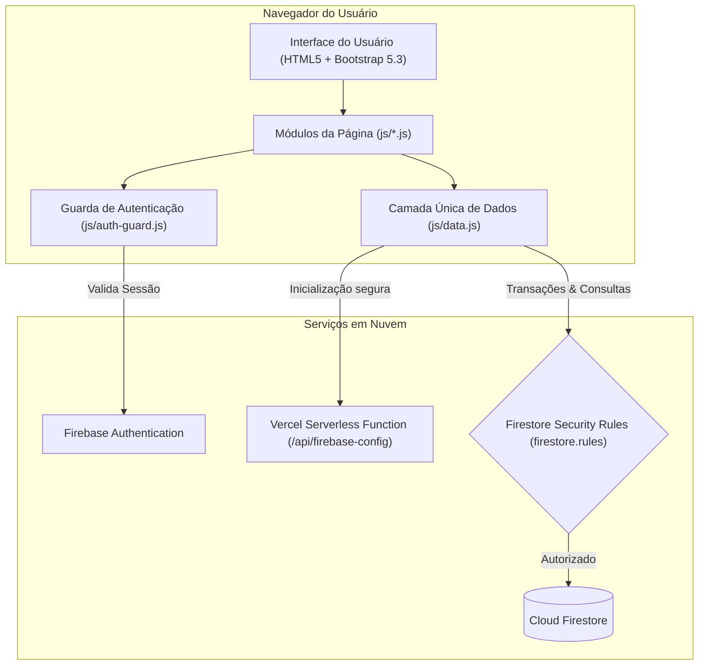
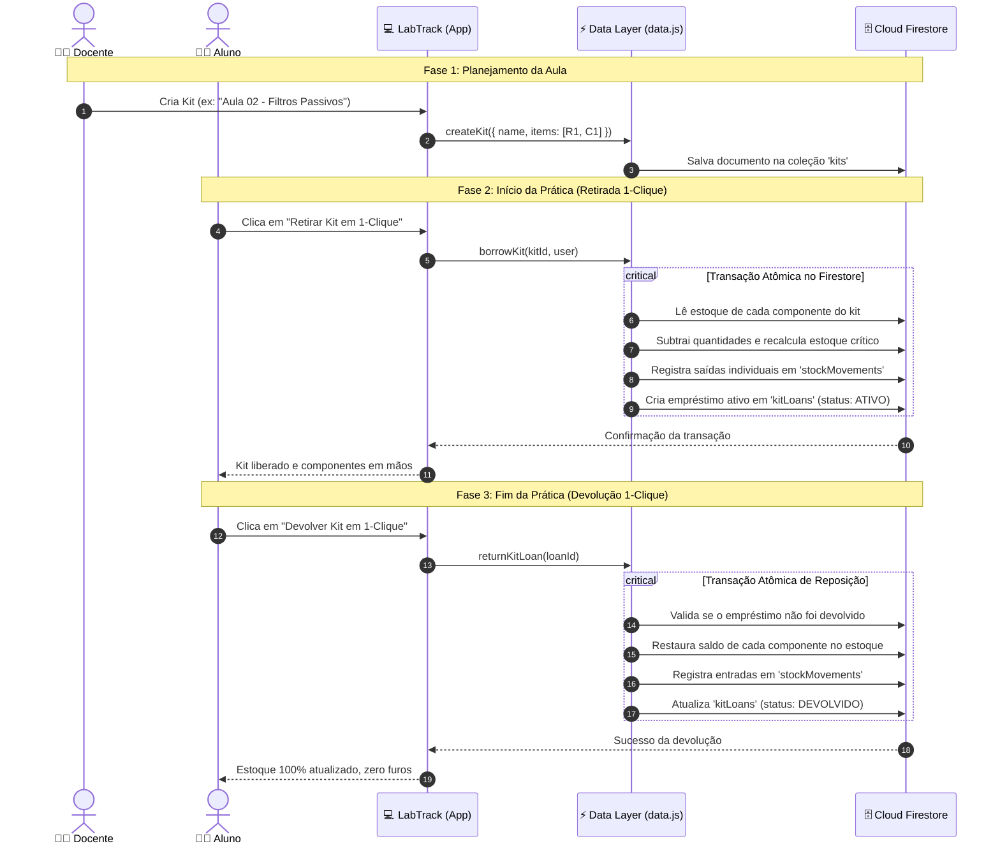

<div align="center">

# ⚡ LabTrack — Gestão de Laboratório Didático

**Sistema ágil, seguro e sem etapa de compilação para controle de inventário, empréstimos de equipamentos e gestão expressa de Kits de Aulas Práticas.**

[](https://developer.mozilla.org/pt-BR/docs/Web/JavaScript/Guide/Modules)
[](https://developer.mozilla.org/pt-BR/docs/Web/HTML)
[](https://developer.mozilla.org/pt-BR/docs/Web/CSS)
[](https://getbootstrap.com/)
[](https://firebase.google.com/)
[](https://vercel.com/)
[](LICENSE)

[Visão Geral](#-visão-geral) •
[Funcionalidades](#-funcionalidades) •
[Tecnologias](#-tecnologias-utilizadas) •
[Arquitetura](#-arquitetura-do-sistema) •
[Fluxos & Diagramas](#-fluxos-e-diagramas) •
[Perfis & Segurança](#-perfis-de-acesso-rbac) •
[Como Executar](#-como-executar-localmente) •
[Deploy](#-deploy)

</div>

---

## 📌 Visão Geral

Em laboratórios didáticos de cursos técnicos e engenharias, o uso diário de componentes eletrônicos, placas e ferramentas frequentemente enfrenta desafios operacionais:
* Alunos retirando dezenas de componentes avulsos antes da aula e devolvendo manualmente um por um;
* Esquecimentos de devolução ao final da aula prática;
* Devoluções em duplicidade no sistema gerando furos e divergências no estoque;
* Dificuldade para rastrear com quem está cada microcontrolador ou ferramenta de precisão.

O **LabTrack** foi desenvolvido para resolver esses problemas por meio de uma arquitetura limpa e moderna: centraliza o inventário, automatiza o ciclo de vida de **Kits de Aulas Práticas com 1-Clique**, assegura transações atômicas no banco de dados e aplica rígidas regras de controle de acesso baseadas em papéis (RBAC).

---

## ✨ Funcionalidades

### 📦 Kits de Aulas Práticas (1-Clique)
- **Criação de Kits por Docentes:** Professores organizam kits customizados para suas aulas práticas (ex.: *"Aula 03 - Amplificadores Operacionais"*, *"Aula 01 - Arduino & Sensores"*), definindo os componentes e quantidades necessárias.
- **Retirada Expressa em 1-Clique:** Com apenas um clique, o aluno ou docente retira o kit. Uma transação atômica valida a disponibilidade, reduz os saldos no estoque e gera registros automáticos de saída para auditoria.
- **Devolução Expressa em 1-Clique:** Ao fim da aula, a devolução repõe imediatamente todos os componentes no estoque e marca o kit como devolvido, impedindo devoluções repetidas ou esquecidas.

### 🔬 Inventário Inteligente de Componentes
- Cadastro dinâmico de componentes com suporte a atributos configuráveis (ex.: resistência, tolerância, encapsulamento, fabricante).
- Alerta visual de **estoque crítico** acionado automaticamente quando o saldo atinge o valor mínimo cadastrado.
- Filtros rápidos por tipo, disponibilidade (em estoque, crítico, esgotado) e pesquisa textual por código interno, fabricante ou localização física.

### 🛠️ Gestão de Ferramentas & Microcontroladores
- Controle individual de instrumentos (osciloscópios, multímetros, fontes) e placas (Arduino, ESP32, Raspberry Pi Pico).
- Estados operacionais: `DISPONIVEL`, `EMPRESTADA`, `MANUTENCAO` e `INDISPONIVEL`.
- Empréstimo com definição de responsável e data prevista de devolução.
- **Bloqueio de Devolução por Terceiros:** Apenas o próprio responsável ou um administrador pode registrar o retorno do item.

### 📊 Painel de Histórico, Auditoria & KPIs
- Histórico unificado consolidando movimentações de estoque, empréstimos de ferramentas, placas e kits.
- Estatísticas individuais por usuário (total de empréstimos, devoluções pendentes e itens em atraso).
- Exportação de relatórios da auditoria em formato **CSV**.

### 🌓 Interface Acessível & Responsiva
- Layout moderno construído com **Bootstrap 5.3.3** e ícones **Bootstrap Icons**.
- Alternância entre **Modo Claro (Light)** e **Modo Escuro (Dark)** com persistência da preferência no navegador.
- Modal global **"Meus Empréstimos"** acessível do cabeçalho em qualquer tela para devolução rápida.

---

## 🛠️ Tecnologias Utilizadas

| Camada | Tecnologia | Descrição |
|---|---|---|
| **Frontend** |    | Interface responsiva com CSS modular e Bootstrap 5 via CDN. |
| **Lógica** |  | JavaScript moderno (ES6+) organizado em **ES Modules** nativos, sem necessidade de bundlers. |
| **Autenticação** |  | Gerenciamento de credenciais, sessões seguras e auto-cadastro controlado. |
| **Banco de Dados** |  | NoSQL em tempo real com transações atômicas ACID para integridade de estoque. |
| **Segurança** |  | Regras declarativas rigorosas aplicadas diretamente no banco de dados. |
| **Hospedagem & API**|  | Deploy contínuo com Serverless Function (`api/firebase-config.js`) para injeção segura de credenciais. |

---

## 🏛️ Arquitetura do Sistema

O projeto adota uma filosofia **Zero-Build** (sem `webpack`, `vite` ou compilação prévia), permitindo execução direta pelo navegador com alta manutenibilidade e performance:



---

## 🔄 Fluxos e Diagramas

### Ciclo de Vida do Kit de Aula Prática (1-Clique)



---

## 👥 Perfis de Acesso (RBAC)

O acesso é controlado tanto na interface (`auth-guard.js`) quanto verificado de forma definitiva pelo servidor nas regras do banco (`firestore.rules`):

| Funcionalidade | `ADMIN` | `DOCENTE` | `ALUNO` | `VISITANTE` |
|---|:---:|:---:|:---:|:---:|
| Visualizar catálogo de itens e estoque | ✅ | ✅ | ✅ | ✅ |
| Consultar disponibilidade de kits | ✅ | ✅ | ✅ | ✅ |
| Retirar e Devolver Kits de Aula (1-clique) | ✅ | ✅ | ✅ | ❌ |
| Empréstimo e devolução de ferramentas/placas | ✅ | ✅ | ✅ *(próprios)* | ❌ |
| Movimentações manuais avulsas de estoque | ✅ | ✅ | ✅ | ❌ |
| Criar e editar Kits de Aulas Práticas | ✅ | ✅ | ❌ | ❌ |
| Cadastrar novos componentes, ferramentas e placas | ✅ | ✅ | ❌ | ❌ |
| Gestão de tipos de componentes e atributos | ✅ | ❌ | ❌ | ❌ |
| Hub de auditoria, KPIs e gerenciamento de usuários | ✅ | ❌ | ❌ | ❌ |

---

## 📂 Estrutura do Repositório

```text
gestao-lab/
├── api/
│   └── firebase-config.js      # Endpoint serverless que entrega a config segura
├── css/
│   └── styles.css              # Customizações e estilos globais do tema
├── js/
│   ├── firebase-config.js      # Inicialização do Firebase e suporte a emuladores
│   ├── auth-guard.js           # Controle de sessão, rotas e perfis de usuário
│   ├── data.js                 # Camada única de dados e transações do Firestore
│   ├── nav.js                  # Navegação unificada, alternância de tema e Meus Empréstimos
│   ├── utils.js                # Tratamento HTML, datas, notificações toasts e helpers
│   ├── kits.js                 # Lógica da tela de Kits de Aulas Práticas
│   ├── dashboard.js            # Indicadores e alertas do painel inicial
│   ├── components.js           # Catálogo e filtros de componentes
│   ├── tools.js                # Gestão de ferramentas e empréstimos
│   ├── microcontrollers.js     # Gestão de placas e empréstimos
│   ├── movements.js            # Histórico de movimentações manuais de estoque
│   ├── search.js               # Mecanismo de busca global
│   └── admin-*.js              # Módulos administrativos (usuários, tipos, auditoria)
├── index.html                  # Painel Principal (Dashboard)
├── kits.html                   # Página de Kits de Aulas Práticas
├── components.html             # Catálogo de componentes
├── tools.html                  # Equipamentos e ferramentas
├── microcontrollers.html       # Microcontroladores e placas
├── movements.html              # Registro de movimentações avulsas
├── search.html                 # Página de busca geral
├── login.html / register.html  # Autenticação de usuários
├── firestore.rules             # Regras declarativas de segurança do Firestore
├── firestore.indexes.json      # Índices compostos versionados
├── firebase.json               # Configurações de deploy do Firebase
├── vercel.json                 # Configuração de rotas limpas e cabeçalhos HTTP
└── .env.example                # Modelo de variáveis de ambiente necessárias
```

---

## 🚀 Como Executar Localmente

Como a aplicação é modular e sem etapa de build, você só precisa de um servidor HTTP estático para testar.

### 1. Clonar o repositório
```bash
git clone https://github.com/seu-usuario/gestao-lab.git
cd gestao-lab
```

### 2. Configurar variáveis de ambiente
Crie um arquivo `.env.local` na raiz baseado no modelo `.env.example`:
```bash
cp .env.example .env.local
```
Preencha as variáveis com as credenciais do seu projeto Firebase Console.

### 3. Iniciar o servidor de desenvolvimento
Você pode utilizar o utilitário da Vercel (recomendado para carregar o endpoint de configuração) ou qualquer servidor HTTP:

**Opção A — Com a Vercel CLI (Recomendado):**
```bash
npx vercel dev
```
Acesse `http://localhost:3000`.

**Opção B — Com os Emuladores do Firebase:**
Se preferir rodar com o Firestore Emulator local, habilite `window.USE_FIREBASE_EMULATOR = true` em `js/firebase-config.js` e execute:
```bash
npx serve .
```

---

## 🌐 Deploy

### 1. Hospedagem na Vercel
1. Conecte o repositório no painel da [Vercel](https://vercel.com).
2. Nas configurações do projeto (**Project Settings > Environment Variables**), adicione as variáveis listadas em `.env.example`:
   * `FIREBASE_API_KEY`
   * `FIREBASE_AUTH_DOMAIN`
   * `FIREBASE_PROJECT_ID`
   * `FIREBASE_STORAGE_BUCKET`
   * `FIREBASE_MESSAGING_SENDER_ID`
   * `FIREBASE_APP_ID`
   * `FIREBASE_MEASUREMENT_ID` *(opcional)*
3. Realize o deploy. O arquivo `vercel.json` cuidará automaticamente de URLs limpas e cabeçalhos de segurança (HSTS, CSP, X-Frame-Options).

### 2. Publicação das Regras e Índices do Firestore
Com o [Firebase CLI](https://firebase.google.com/docs/cli) instalado e logado na sua conta:
```bash
npx firebase-tools deploy --only firestore:rules,firestore:indexes
```

---

## 🔒 Segurança e Boas Práticas

* **Credenciais Protegidas:** Nenhuma chave de API ou segredo sensível fica gravado em código-fonte.
* **Transações Concorrentes:** Todas as alterações de saldo de inventário utilizam `runTransaction()`, prevenindo condições de corrida (*race conditions*).
* **Defesa em Profundidade:** A interface oculta ações com base no perfil logado, mas a autorização definitiva e inviolável é executada diretamente pelas `firestore.rules`.
* **Proteção contra Injeção:** Tratamento rigoroso de caracteres com escape HTML antes de qualquer inserção dinâmica no DOM.

---

## 📄 Licença

Este projeto está sob a licença [MIT](LICENSE) — sinta-se livre para utilizar, modificar e distribuir conforme necessário para fins educacionais ou comerciais.

---

<div align="center">
  <sub>Desenvolvido para modernizar a gestão de laboratórios de tecnologia e eletrônica.</sub>
</div>
